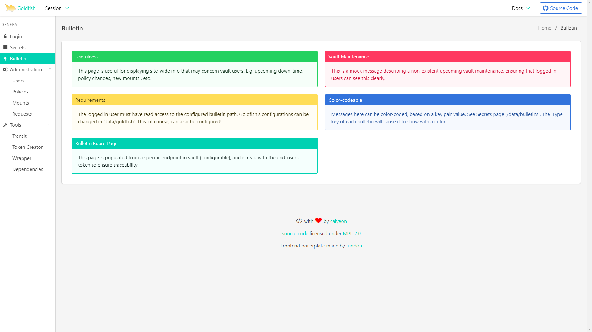
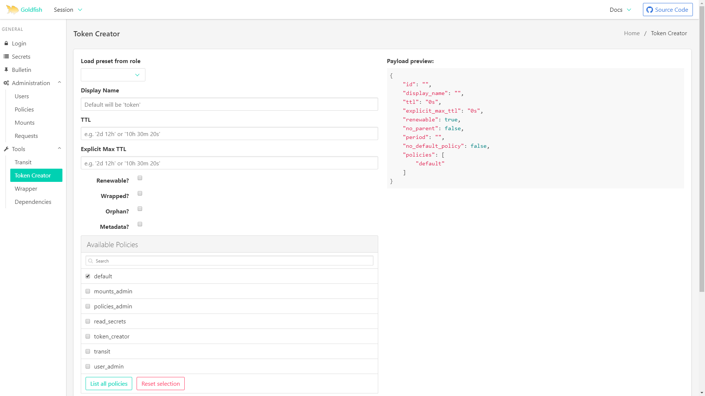
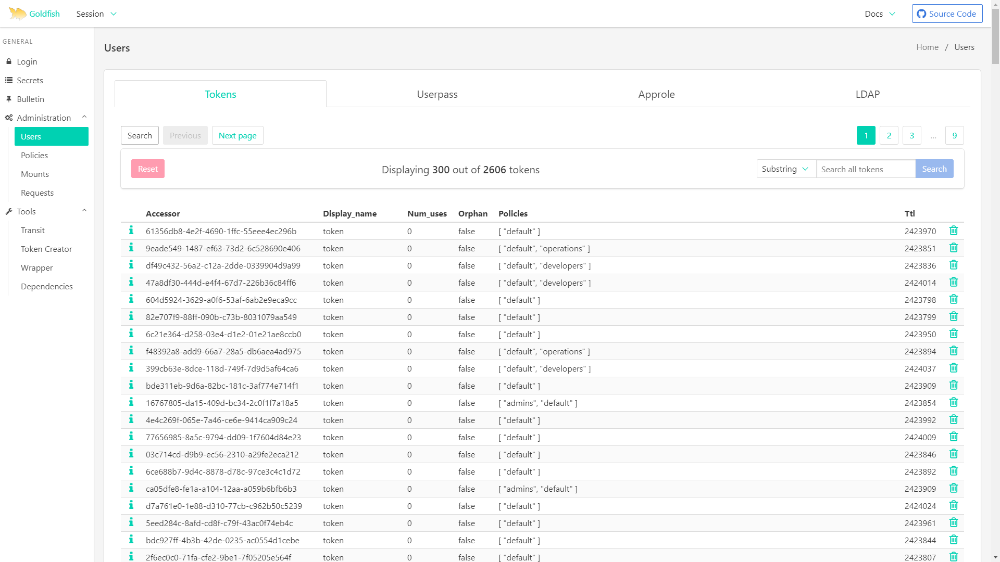

<div align="center">

<h3>Goldfish Vault UI - <a href="https://vault-ui.io">Live Demo </a> </h3>

<p></p>

<h3>Share with your colleagues and star this repo!</h3>

</div>

## What is this?

[Goldfish](https://vault-ui.io) is a HashiCorp Vault UI

Goldfish answers many auditing and administration questions that Vault API can't:

* Right now, are there any root tokens in Vault?
* Which policies, users, and tokens can access this particular secret path?
* The unseal admins are working from home, but we need a policy changed.
	* How do we generate a root token only for this change, and make sure it's revoked after?
* I store my policies on a Github repo. Can I deploy all my policies in one go? [See more](https://github.com/Caiyeon/goldfish/wiki/Features#request-policy-change-by-github-commit)
* *Coming soon* If I remove this secret/policy, will anybody's workflow break?


<!--
-->
## [Deploy goldfish in production in minutes!](https://github.com/Caiyeon/goldfish/wiki/Production-Deployment)

Seriously, the instructions fit on one screen!


<!--
-->
## Features

* [x] Hot-loadable server settings from a provided vault endpoint
* [x] Displaying a vault endpoint as a 'bulletin board' in homepage
* [x] **Logging in** with token, userpass, github, or LDAP
* [x] **Secret** Reading/editing/creating/listing
* [x] **Auth** Searching/creating/listing/deleting
* [x] **Mounts** Listing
* [x] **Policies** Searching/Listing
* [x] Encrypting and decrypting arbitrary strings using transit backend

#### Major features: [See wiki for more](https://github.com/Caiyeon/goldfish/wiki/Features)
* [x] **DONE!** Searching tokens by policy [walkthrough](https://github.com/Caiyeon/goldfish/wiki/Features#searching-tokens)
	- E.g. Display all tokens that have the policy 'admins'
* [x] **DONE!** Searching policy by rule [walkthrough](https://github.com/Caiyeon/goldfish/wiki/Features#searching-policies)
	- E.g. Display all policies that can access 'secret/data*'
* [x] **DONE!** Request & approval based policy changes [walkthrough](https://github.com/Caiyeon/goldfish/wiki/Features#policy-change-requests)
	- Users can place a policy change request in vault
	- Admins must then provide unseal tokens for that specific request
	- Upon reaching a set number, goldfish generates a root token, performs edit, and revokes the root token
* [x] **DONE!** **Terraform your vault** [walkthrough](https://github.com/Caiyeon/goldfish/wiki/Features#request-policy-change-by-github-commit)
	- Fetch a folder of policies from a commit in github
	- Admins can enter their unseal tokens for approval to set vault policies according to policies found
	- Change dozens of policies in one go!
* [ ] Resource dependency chain
	- E.g. Will removing a particular policy affect current users?
	- Will removing a mount or secret path affect current users?
* [ ] Certificate management panel
	- If vault is a certificate authority, there should be a user-friendly panel of details and statistics
* [ ] Moving root tokens away from the human eye
	- More root operations like mount tuning should also be done via request & approval basis, like policy changes
* [ ] Secret backend specific tools (e.g. AWS backend)


<!--
-->
## Screenshots











<!--
-->
## Developing or testing goldfish

#### Running locally
You'll need go (v1.8), npm (>=3), and nodejs (>=5).

```bash
# hashicorp vault ui

# download goldfish first
go get github.com/caiyeon/goldfish
cd $GOPATH/src/github.com/caiyeon/goldfish

# you'll need a vault instance. Force a root token for consistency
vault server -dev -dev-root-token-id=goldfish &
export VAULT_ADDR=http://127.0.0.1:8200
export VAULT_TOKEN=goldfish

# this transit key is needed to encrypt/decrypt user credentials
vault mount transit
vault write -f transit/keys/goldfish

# see vagrant/policies/goldfish.hcl for the required policy.
# transit key is not changable, but the secret path containing run-time settings can be changed
vault policy-write goldfish vagrant/policies/goldfish.hcl

# goldfish launches strictly from approle, because passing a token that humans can see would be silly
vault auth-enable approle
vault write auth/approle/role/goldfish role_name=goldfish secret_id_ttl=5m token_ttl=480h \
token_max_ttl=720h secret_id_num_uses=1 policies=default,goldfish
vault write auth/approle/role/goldfish/role-id role_id=goldfish

# build the backend server
go install

# run backend server with secret_id generated from approle
# -dev arg skips reading settings from vault and uses a default set
goldfish -dev -vault_token $(vault write -f -wrap-ttl=20m \
-format=json auth/approle/role/goldfish/secret-id \
| jq -r .wrap_info.token)

# run frontend in dev mode (with hot reload)
cd frontend
sudo npm install -g cross-env
npm install
npm run dev

# a browser window/tab should open, pointing directly to goldfish

# "-dev" disables many security standards. DO NOT USE -dev IN PRODUCTION!
```


#### Using a VM
While go and npm works decently on Windows, there is a one-line solution to spinning up a VM which will contain a dev vault instance and goldfish with hot-reload.

You'll need [Vagrant](https://www.vagrantup.com/downloads.html) and [VirtualBox](https://www.virtualbox.org/). On Windows, a restart after installation is needed.

```bash
# if you wish to launch goldfish in a VM:
git clone https://github.com/Caiyeon/goldfish.git
cd goldfish/vagrant

# this will take awhile
vagrant up --provision

# open up localhost:8001 in chrome on your local machine. You can login with token 'goldfish'
```


<!--
-->
## Development
Goldfish is in very active development:


Pull requests and feature requests are welcome. Feel free to suggest new workflows by opening issues.


<!--
-->
## Components

Frontend:
* VueJS
* Bulma CSS
* Vue Admin

Backend:
* [Vault API](https://godoc.org/github.com/hashicorp/vault/api) wrapper


<!--
-->
## Design

See: [Architecture](https://github.com/Caiyeon/goldfish/wiki/Architecture)


<!--
-->
## Why 'Goldfish'?

This server should behave as a goldfish, forgetting everything immediately after a request is completed. That, and other inside-joke reasons.

Credits for the goldfish icon goes to [Laurel Chan](https://www.linkedin.com/in/laurel-chan-11baa286)
